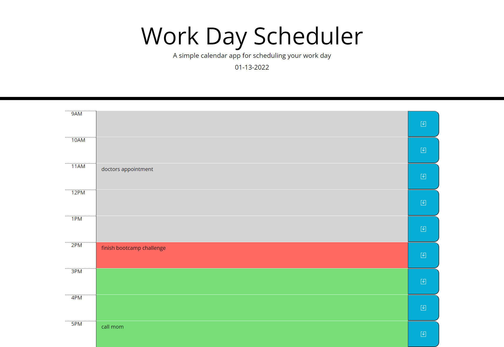

# Work Day Scheduler
  
 
 ## Description
 
 Schedule your work day with a with in put saved to your localStorage and boxes tht change colour based on what time of day it is.
   

 ## Table of Contents
 * [Installation](#Installation)
 * [Usage](#Usage)
 * [Contributing](#Contributing)
 * [Tests](#Tests)
 * [Questions](#Questions)
 
 ## Installation
 Download this repository or open up the deployed webpage at https://maks-pixel.github.io/wk5-schedule/

 ## Usage
 input your tasks in the text boxes and save your input by clicking the saved button on the right side of each box 
 
 ## Contributing
 N/A

 ## Tests
 N/A

 ## Questions
 here is the link to my Github: [github.com/maks-pixel](github.com/maks-pixel)
 If you have any questions regarding the project or anything else you can contact me at:
 
  Email: [maksgirmay@gmail.com](maksgirmay@gmail.com) 
